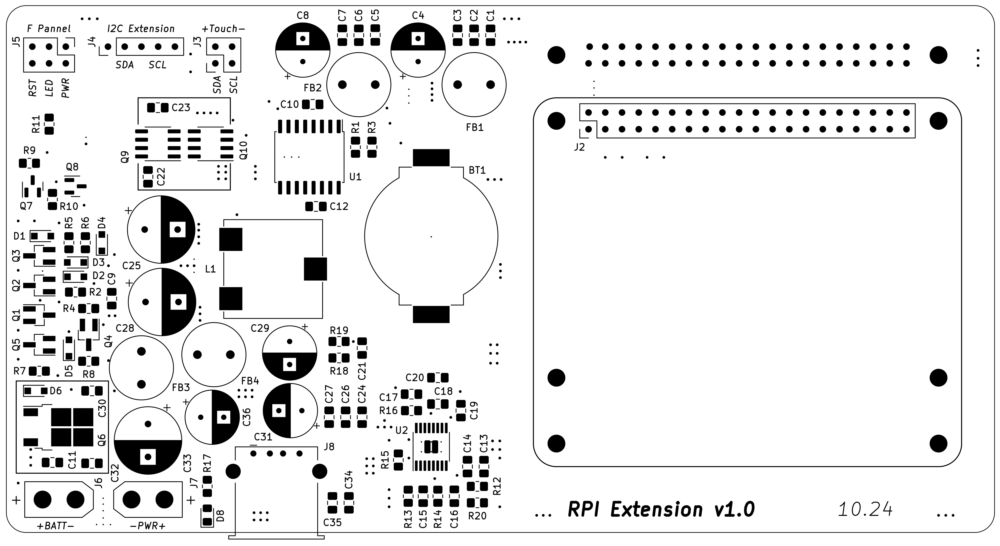

# Raspberry Pi - Radioberry interconnection board

This project is a PCB design to create SDR transceiver using
Raspberry Pi and Radioberry boards. Simple connection of boards
seems incomplete:

- usually LCD Touch screen is used which creates EMI
- touch screen usually requires I2C bus but it's already used on a Raspberry header
- switching on/off requires USB connection - strange for complete inbox design
- no RTC
- complete design requires BMS monitoring but again I2C is already occupied

## Main Features

- Radioberry shield (mainly EMI caused by LCD touchscreen)
- 12V battery power supply (switching converter to 5V USB)
- ON/OFF circuits with indication
- RTC

For design is used KiCad Version 6.0.11

Documentation is available under **doc** folder

Prepared fabrication files under **gerber** folder